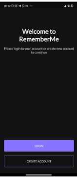
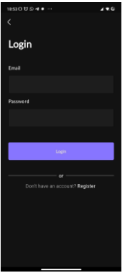
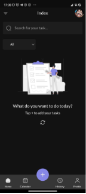

# Remember Me

Simple task list app

# Features

- Management task
- Authentication
- Create own category
- Custom icon category
- Custom Color Category

# ScreenShoot

## Rest Api Repo
<a href="https://github.com/Farriq-mfq/RememberMe-Rest-Api">Remember Me rest api ( PRESS ME ) 😁</a>
## Desain Inspiration
<a href="https://www.figma.com/file/029hqnIvD90UN7QEQ9NQKE/UpTodo---Todo-list-app-UI-Kit-(Community)?type=design&node-id=69-6594&mode=design&t=8p6x9wre93HYXTzV-0">👉 Figma</a>
